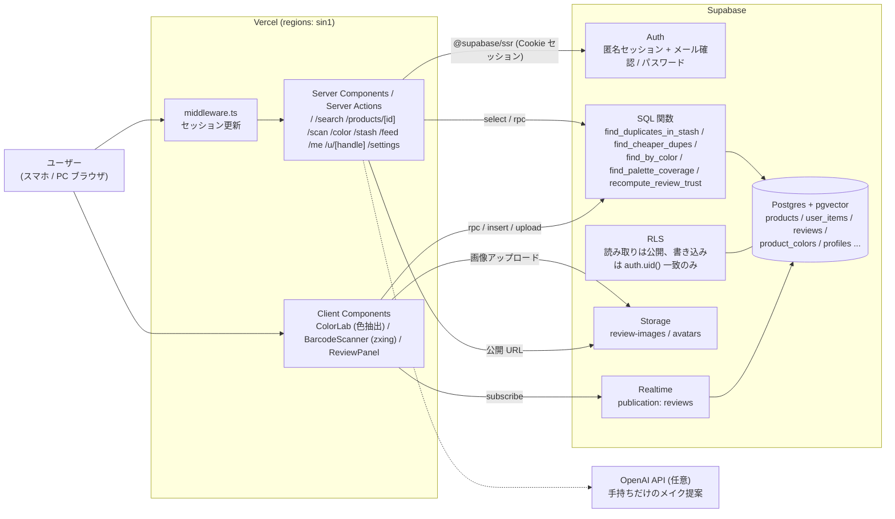
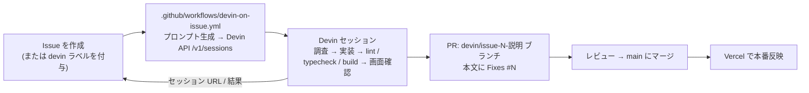

# KAWANAI

「本当に自分に合うもの」を、成分と色の数値で見つけるアプリ。

LIPS や @cosme は「何を買うか」を決めるアプリ。KAWANAI は手持ちコスメと候補商品を **全成分ベクトル**と **CIELAB の色差 ΔE(CIEDE2000)** で突き合わせ、「それ、もう持っています」「同じ処方でこっちが ¥2,820 安い」を数値で示す。

## 機能

| 機能 | 実装 |
| --- | --- |
| トップ | `/`。未ログインは紹介ページ、本アカウントは肌情報・ポーチをもとにしたおすすめ |
| 商品を探す | `/search`。商品名検索・カテゴリ・メンズ絞り込み。信用できる口コミの評価が高い順 |
| 手持ち登録 | `/scan`（本アカウント限定）。人気商品のチェックリストで一括登録 + zxing の連続バーコードスキャン |
| 被り検出 | `find_duplicates_in_stash` / `find_stash_overlaps`（pgvector cosine + ΔE） |
| 安い代替 | `find_cheaper_dupes`（類似スコア閾値 × 価格差） |
| 口コミ信頼度 | `recompute_review_trust`。スコアと除外理由は内部で使い、UI には出さない |
| 画像から色検出 | `/color`。主要色を抽出 → Lab 変換 → `find_by_color`。色名・系統・肌トーン順で提示 |
| 手持ちだけのメイク提案 | `/stash`（本アカウント限定）。`OPENAI_API_KEY` があれば LLM、無ければルールベース |
| 認証 / プロフィール | `/login`（初回はメールのリンクで確認し、プロフィール作成画面でパスワードを設定。以降はメールアドレス＋パスワードでログイン）、`/settings`、`/me`、`/u/[handle]` |
| 画像つき口コミ | `/feed`。1投稿4枚まで、Supabase Storage の `review-images` に保存。アップロード時に長辺1600pxのWebPへ縮小し、一覧はサムネ幅で読む |
| 成分の日本語化 | `src/lib/ingredients.ts` の辞書で日本語名・役割・効果に変換 |
| 使用感 | `src/lib/feel.ts`。口コミがあれば平均、無ければ成分からの推定 |
| メンズ | シャンプー / トリートメント / BB / 日焼け止めをカテゴリに保持 |

## 構成



## Supabase の使いどころ

| Supabase の機能 | 使い方 | 主な実装 |
| --- | --- | --- |
| Postgres | 商品・ブランド・成分マスタ・手持ち（`user_items`）・口コミ・プロフィールを保持。被り判定も DB 側で完結させ、アプリ側は表示だけにする | `supabase/migrations/20260815000100_init.sql` |
| pgvector | 全成分を 256 次元にハッシュした `products.ingredient_vec`（`vector(256)`）。`ivfflat` + `vector_cosine_ops` インデックスで cosine 距離検索。トリガ `trg_products_vec` が成分の更新時にベクトルを張り直す | `20260815000100_init.sql` / `20260815000400_ingredient_vector.sql` / `20260815000500_ingredient_idf.sql` |
| SQL 関数 | 色差 `lab_delta_e`（CIEDE2000）、被り `find_duplicates_in_stash` / `find_stash_overlaps`、安い代替 `find_cheaper_dupes`、色検索 `find_by_color`、パレット網羅率 `find_palette_coverage`、口コミ信頼度 `recompute_review_trust`。クライアントからは `supabase.rpc(...)` で呼ぶ。全関数は `search_path` を固定（Supabase linter の `0011_function_search_path_mutable` 対応） | `20260815000200_functions.sql` / `20260815000800_product_colors.sql` / `20260815000300_review_trust.sql` / `20260815000700_harden_functions.sql` |
| RLS | 全テーブルで有効。カタログ（`products` / `brands` / `ingredients_master` / `product_colors` / `reviews`）は select 公開、ユーザーデータ（`user_items` / `profiles` / `profile_allergens` / `skipped_purchases` / `review_images` / `review_reports`）の書き込みは `auth.uid() = user_id` の行だけ。ポーチ（`user_items`）は本人のほか、`profiles.stash_public` を立てている人のぶんだけユーザーページから閲覧できる。投稿制限（本アカウント必須・ポーチ登録済みのみ・件数上限）もポリシーとトリガで DB 側に置き、API を経由しない書き込みでも守られるようにする | `20260816000100_profiles_and_reviews.sql` / `20260817000100_fit_and_review_weighting.sql` / `20260818000100_profile_personal_color_and_allergens.sql` |
| Auth | 閲覧は匿名セッション（`signInAnonymously`）で開始し、口コミ投稿・ポーチは本アカウントのみ許可。初回はメールのリンクで確認してからパスワードを設定し、以降はメール＋パスワード。セッションは `@supabase/ssr` の Cookie で持ち、`middleware.ts` が期限が近いときだけトークンを更新する | `src/components/AnonAuth.tsx` / `src/components/LoginForm.tsx` / `src/middleware.ts` / `src/lib/auth.ts` |
| Storage | 口コミ画像は `review-images`、アイコンは `avatars`。どちらも公開読み取り + `storage.foldername(name)[1] = auth.uid()` の所有者のみ書き込み | `20260816000100_profiles_and_reviews.sql` / `20260818000100_profile_personal_color_and_allergens.sql` / `src/lib/storage.ts` |
| Realtime | `reviews` を `supabase_realtime` publication に追加し、`recompute_review_trust` による補正後の評価を商品ページへそのまま流す | `20260815000300_review_trust.sql` / `src/components/ReviewPanel.tsx` |

## Devin の使い方

開発は Issue 起点で回している。Issue を立てると GitHub Actions が Devin のセッションを作り、Devin が調査 → 実装 → 検証 → PR まで進める。人間は Issue を書くこととレビュー・マージだけを担当する。



- ワークフローは `issues: [opened, labeled]` で起動し、Issue 本文に固定の手順（調査 → 最小限の実装 → `npm run lint` / `npx tsc --noEmit` / `npm run build` → 画面のスクリーンショット → `devin/issue-<番号>-<説明>` ブランチで PR）を添えて渡す。`idempotent: true` なので同じ Issue で二重にセッションは立たない。
- セッション作成後、Issue にセッション URL がコメントされ、完了時には原因・変更内容・PR URL・未解決事項が Issue に残る。仕様が曖昧なときはコードを変更せず、調査結果と提案だけを Issue にコメントする運用にしている。
- 実績（2026-08 時点）: この仕組みで立てた Issue は 73 件、そこから Devin が作った PR は 32 本（うち 16 本がマージ済み）で、`devin/*` 以外のブランチからの PR は無い。レスポンシブ崩れの修正、ページ遷移の高速化、デフォルトアイコンの差し替えなど、バグ修正から機能追加まで同じ流れで処理している。

## 成分ベクトル

全成分表示は配合量の多い順に書かれるので、配合順を重みにして 256 次元にハッシュする。

```
w_i = (1 / log2(i + 2)) * idf(ingredient)
```

共通の基剤（水、BG、グリセリンなど）は IDF で寄与を落とす。L2 正規化して pgvector の cosine 距離で比較する。

### 定期再計算

IDF は商品が増えるたびに変わるので、Supabase Cron（`pg_cron`）で日次 18:00 UTC（JST 3:00）に
`refresh_ingredient_idf_logged()` を実行し、DF / IDF を数え直して `products.ingredient_vec` を全行再生成する。
手動で走らせたい場合は `select refresh_ingredient_idf_logged();`。

実行ログは `maintenance_runs` に残る。最終実行はビューで確認する。

```sql
select * from ingredient_idf_status;
-- started_at | finished_at | duration_ms | products | ingredients | status | detail
```

## 色差

HEX → CIELAB に変換し、CIEDE2000 を Postgres 関数 `lab_delta_e` で計算する。

- ΔE < 1：ほぼ判別不能
- ΔE < 2：並べても見分けにくい
- ΔE < 5：似ている

UI には数値を出さず、`src/lib/wording.ts` で「ほぼ同じ色」「かなり近い」などの日本語に置き換える。成分の cosine 類似度も同様に「中身ほぼ同じ」などにする。

## 口コミの不正検出

削除はしない。疑わしい口コミは理由付きで残したまま、総合評価から外す。

- 文体の類似クラスタ / 投稿バースト / 同一ブランドへの偏重 / PR定型文 / 画像 pHash の使い回し

投稿ゲート: 本アカウント必須（未ログインは不可）、ポーチに登録済みの商品のみ、1日5件・同一ブランド1日2件・1商品1件まで。通報3件で総合評価から除外（削除はしない）。

閲覧（商品・成分・口コミ・色検索）はログイン不要で、訪問者に匿名セッションも発行しない（公開読み取りは RLS の select ポリシーで anon ロールに許可している）。初回登録はメールのリンクで確認し、プロフィール作成画面でパスワードを設定する。以降はメールアドレス＋パスワードでログインする。手持ち登録・ポーチの利用・口コミ投稿には本アカウントが必要。

## セットアップ

```bash
npm install
cp .env.example .env.local     # ローカルは npx supabase status のキーを入れる
npx supabase start             # Docker が必要
npm run db:reset               # マイグレーション + シード投入
npm run dev
```

シードを作り直す場合は `npm run seed:gen`（`scripts/generate_seed.py` が決定論的に生成）。

シードの商品・ブランド・口コミはすべて架空。実在商品のデータは使っていない。

## 型定義

`src/lib/supabase/database.types.ts` は `supabase/migrations/` から生成する。マイグレーションを追加・変更したら再生成してコミットする。

```bash
npx supabase start             # ローカルDBが起動していること
npm run db:types
```

## 検証

```bash
npm run lint
npm run typecheck
npm run build
```
