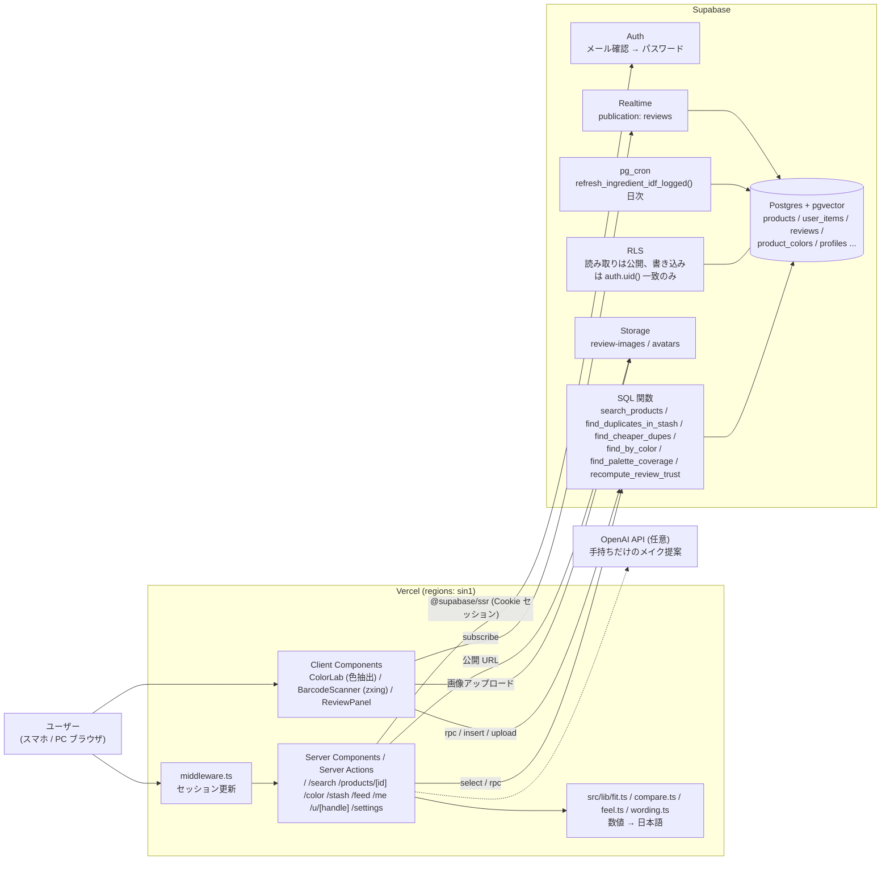
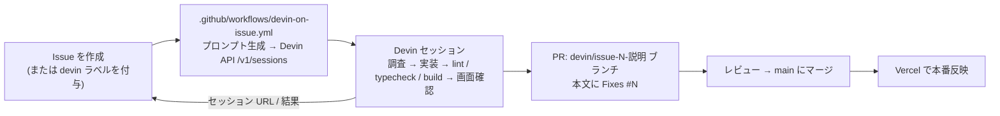

# KAWANAI

「本当に自分に合うもの」を、成分と色の数値で見つけるコスメ判断アプリ。

LIPS や @cosme は「何が人気か」を教えてくれる。KAWANAI は手持ちコスメとプロフィール（肌の状態・肌の色）を持っているので、
気になった商品について **「自分に合うか」「もう似たものを持っていないか」「似ていて安いものはあるか、それでも高い方に良さはあるか」** を数値で判定して見せる。
判定の材料は全成分表示（配合順）と色の実測値（CIELAB / ΔE CIEDE2000）で、口コミは信用できるものだけを集計に入れる。

3日間のハッカソン（AIAU Craft Day）で作った。コードはすべて Devin が書いていて、人間がやったのは仕様の決定と却下、UI 文言の判断だけ。

## 解きたい課題

**課題**: すでに同じようなものを持っているのに気づかないまま、あるいは衝動買いで、コスメを無駄に買ってしまう。

**ターゲット**: 無駄なくコスメを買いたいけれど、何を買えばいいのか分からない学生・社会人。

なぜ判断できないのか。

- **色番号の違いが店頭では分からない**。並べても ΔE が小さければ人の目では区別できないので、持っているものとの被りに気づけない。
- **成分の意味が分からない**。名前は日本語で書いてあっても専門用語の羅列で、それぞれが何のために入っているのか、自分の肌に合うものなのかが読み取れない。だから値段の差が中身の差なのかブランドの差なのかも判断できない。
- **口コミが信用できない**。X などの SNS はステルスマーケティングや PR 投稿が混ざっていて、点数がそのまま信用できない。既存の口コミアプリも人気順で「買う理由」を増やす方向にしか働かないので、「今持っているものと何が違うのか」「自分に合うのか」には答えてくれない。

KAWANAI が答えるのは次の4つ。

- この商品は**自分の肌の状態と肌の色に合うか**（`src/lib/fit.ts`）
- **もう似たものを持っていないか**（成分 cosine + ΔE、`find_duplicates_in_stash`）
- **似ていて安いものはないか**（`find_cheaper_dupes`）
- それでも**高い方に良さはあるか**（使い心地5軸の差分、`src/lib/compare.ts`）

衝動買いは「その場で調べる時間がない」ときに起きるので、名前を入れるだけ（`/search`）で商品ページに判定・被り・安い代替・高い方の良さが全部出るようにした。
手持ちの登録は連続バーコードスキャンでカメラをかざし続けるだけで済ませられる（登録が面倒だと結局使われないため）。
「買わない」ためのアプリではなく、無駄を削って本当に必要なものに予算を回すためのアプリ。

## 機能

| 機能 | 実装 |
| --- | --- |
| トップ | `/`。未ログインは紹介ページ、本アカウントは肌情報・ポーチをもとにしたおすすめ |
| 商品を探す | `/search`。商品名・ブランド名を pg_trgm の類似度で検索（`search_products`）、カテゴリ・メンズ絞り込み。信用できる口コミの評価が高い順 |
| 合うかどうかの判定 | 商品ページ上部（`src/components/FitCard.tsx` / `src/lib/fit.ts`）。肌の状態 × 成分の役割、肌の色に近い色番号を提示。判定できないときは言い切らない |
| 似ていて安い商品との比較 | `src/components/ComparePanel.tsx` / `src/lib/compare.ts`。使い心地5軸のチャートで横並び、価格差と成分の違いを1行で。高い方の良さも同じ大きさで出す |
| 手持ち登録 | `/stash`（本アカウント限定。`/scan` はここへリダイレクト）。人気商品のチェックリストで一括登録（`QuickStartPicker`）+ zxing の連続バーコードスキャン（`BarcodeScanner`） |
| 被り検出 | `find_duplicates_in_stash` / `find_stash_overlaps`（pgvector cosine + ΔE） |
| 安い代替 | `find_cheaper_dupes`（類似スコア閾値 × 価格差） |
| 口コミ信頼度 | `recompute_review_trust`。点数から外した口コミと理由を日本語で確認できる |
| 画像から色検出 | `/color`。主要色を抽出 → Lab 変換 → `find_by_color`。色名・系統・肌トーン順で提示 |
| 手持ちだけのメイク提案 | `/stash`（本アカウント限定）。`OPENAI_API_KEY` があれば LLM、無ければルールベース |
| 認証 / プロフィール | `/login`（初回はメールのリンクで確認し、プロフィール作成画面でパスワードを設定。以降はメールアドレス＋パスワードでログイン）、`/settings`、`/me`、`/u/[handle]` |
| 画像つき口コミ | `/feed`。1投稿4枚まで、Supabase Storage の `review-images` に保存。アップロード時に長辺1600pxのWebPへ縮小し、一覧はサムネ幅で読む |
| 成分の読み解き | `src/lib/ingredients.ts` の辞書で、成分名を日本語名 + 役割（ベース / うるおい / 効果 など）+ 一言効果に変換し、役割でグルーピングして「この商品は何でできているか」を読めるようにする |
| 使用感 | `src/lib/feel.ts`。口コミがあれば平均、無ければ成分からの推定 |
| メンズ | シャンプー / トリートメント / BB / 日焼け止めをカテゴリに保持 |

商品・ブランド・口コミ・成分はすべて架空の生成データで、実商品の JAN マスタは繋いでいない（バーコードは自前のデモコードで読める）。
合うかどうかの判定は肌の状態・肌の色・成分の役割からの推定で、医療・効能の断定はしない。

## 構成

判定は全部 Postgres 側で完結していて、Next.js は RPC を呼んで結果を日本語に直すだけ。



## Supabase の使いどころ

CRUD だけでなく、判定ロジック自体を Postgres 側に置いている。

| Supabase の機能 | 使い方 | 主な実装 |
| --- | --- | --- |
| Postgres | 商品・ブランド・成分マスタ・手持ち（`user_items`）・口コミ・プロフィールを保持。被り判定も DB 側で完結させ、アプリ側は表示だけにする | `supabase/migrations/20260815000100_init.sql` |
| pgvector | 全成分を 256 次元にハッシュした `products.ingredient_vec`（`vector(256)`）。HNSW + `vector_cosine_ops` インデックスで cosine 距離検索（手持ちとの突き合わせは件数が少ないので全件計算）。トリガ `trg_products_vec` が成分の更新時にベクトルを張り直す | `20260815000400_ingredient_vector.sql` / `20260815000500_ingredient_idf.sql` / `20260819000100_hnsw_ingredient_vec.sql` |
| pg_trgm | 商品名・ブランド名の部分一致と類似度検索（GIN 索引）。`search_products` が `/search` の並びを作る | `20260819000100_product_search.sql` |
| SQL 関数 | 色差 `lab_delta_e`（CIEDE2000）、被り `find_duplicates_in_stash` / `find_stash_overlaps`、安い代替 `find_cheaper_dupes`、色検索 `find_by_color`、パレット網羅率 `find_palette_coverage`、口コミ信頼度 `recompute_review_trust`。クライアントからは `supabase.rpc(...)` で呼ぶ。全関数は `search_path` を固定（Supabase linter の `0011_function_search_path_mutable` 対応） | `20260815000200_functions.sql` / `20260815000800_product_colors.sql` / `20260815000300_review_trust.sql` / `20260815000700_harden_functions.sql` |
| pg_cron | IDF の日次再計算と実行ログ（`maintenance_runs` / `ingredient_idf_status`） | `20260819000200_ingredient_idf_cron.sql` |
| RLS | 全テーブルで有効。カタログ（`products` / `brands` / `ingredients_master` / `product_colors` / `reviews`）は select 公開、ユーザーデータ（`user_items` / `profiles` / `profile_allergens` / `skipped_purchases` / `review_images` / `review_reports`）の書き込みは `auth.uid() = user_id` の行だけ。ポーチ（`user_items`）は本人のほか、`profiles.stash_public` を立てている人のぶんだけユーザーページから閲覧できる。投稿制限（本アカウント必須・件数上限）もポリシーとトリガで DB 側に置き、API を経由しない書き込みでも守られるようにする | `20260815000600_review_policies.sql` / `20260816000100_profiles_and_reviews.sql` / `20260817000100_fit_and_review_weighting.sql` / `20260818000100_profile_personal_color_and_allergens.sql` |
| Auth | 初回はメールのリンクで確認してからパスワードを設定し、以降はメール＋パスワード。訪問者に匿名セッションは発行しない。セッションは `@supabase/ssr` の Cookie で持ち、`middleware.ts` が期限が近いときだけトークンを更新する | `src/components/LoginForm.tsx` / `src/app/auth/callback/route.ts` / `src/middleware.ts` / `src/lib/auth.ts` |
| Storage | 口コミ画像は `review-images`、アイコンは `avatars`。どちらも公開読み取り + `storage.foldername(name)[1] = auth.uid()` の所有者のみ書き込み | `20260816000100_profiles_and_reviews.sql` / `20260818000100_profile_personal_color_and_allergens.sql` / `src/lib/storage.ts` |
| Realtime | `reviews` を `supabase_realtime` publication に追加し、`recompute_review_trust` による補正後の評価を商品ページへそのまま流す | `20260815000300_review_trust.sql` / `src/components/ReviewPanel.tsx` |

## Devin の使い方

開発は Issue 起点で回している。Issue を立てると GitHub Actions が Devin のセッションを作り、Devin が調査 → 実装 → 検証 → PR まで進める。人間は Issue を書くこととレビュー・マージだけを担当する。



- ワークフローは `issues: [opened, labeled]` で起動し、Issue 本文に固定の手順（調査 → 最小限の実装 → `npm run lint` / `npx tsc --noEmit` / `npm run build` → 画面のスクリーンショット → `devin/issue-<番号>-<説明>` ブランチで PR）を添えて渡す。`idempotent: true` なので同じ Issue で二重にセッションは立たない。
- セッション作成後、Issue にセッション URL がコメントされ、完了時には原因・変更内容・PR URL・未解決事項が Issue に残る。仕様が曖昧なときはコードを変更せず、調査結果と提案だけを Issue にコメントする運用にしている。
- 実績（2026-08-16 時点）: Issue 88 件、PR 104 本（うち 37 本マージ済み）で、`devin/*` 以外のブランチから出た PR は 1 本も無い。レスポンシブ崩れの修正、ページ遷移の高速化、デフォルトアイコンの差し替えなど、バグ修正から機能追加まで同じ流れで処理している。
- エージェントが自走できるようにリポジトリ側も整えている。`npm run db:reset` 一発でスキーマ + シードが再現し、`npm run seed:gen`（`scripts/generate_seed.py`）は決定論的にシードを作るので被り検出の結果が毎回同じになる。`.env.example` には必要な環境変数と、無い場合の挙動を書いてある。

## 成分ベクトル

全成分表示は配合量の多い順に書かれるので、配合順を重みにして 256 次元にハッシュする。

```
w_i = (1 / log2(i + 2)) * idf(ingredient)
```

共通の基剤（水、BG、グリセリンなど）は IDF で寄与を落とす。L2 正規化して pgvector の cosine 距離で比較する。
ベクトル生成は Postgres 側の `build_ingredient_vec` + トリガなので、商品を入れれば自動で計算される。

### 定期再計算

IDF は商品が増えるたびに変わるので、Supabase Cron（`pg_cron`）で日次 18:00 UTC（JST 3:00）に
`refresh_ingredient_idf_logged()` を実行し、DF / IDF を数え直して `products.ingredient_vec` を全行再生成する。
手動で走らせたい場合は `select refresh_ingredient_idf_logged();`。

実行ログは `maintenance_runs` に残る。最終実行はビューで確認する。

```sql
select * from ingredient_idf_status;
-- started_at | finished_at | duration_ms | products | ingredients | status | detail
```

## 色差

HEX → CIELAB に変換し、CIEDE2000 を Postgres 関数 `lab_delta_e` で計算する。

- ΔE < 1：ほぼ判別不能
- ΔE < 2：並べても見分けにくい
- ΔE < 5：似ている

UI には数値を出さず、`src/lib/wording.ts` で「ほぼ同じ色」「かなり近い」などの日本語に置き換える。成分の cosine 類似度も同様に「中身ほぼ同じ」などにする。
ΔE や信頼度スコアは判定に使い、画面には出さないという方針。

## 使い心地

成分は「中身が同じか」を示せるが、使い心地までは語れない。`src/lib/feel.ts` でツヤ / カバー力 / 崩れにくさ / うるおい / 伸び（ヘア系は別軸）を、
口コミがあればその平均、無ければ配合順からの推定値として同じ軸で扱い、比較チャートに使う。

## 口コミの不正検出

削除はしない。疑わしい口コミは理由付きで残したまま、総合評価から外す。

- 文体の類似クラスタ / 投稿バースト / 同一ブランドへの偏重 / PR定型文 / 画像 pHash の使い回し（`src/lib/phash.ts`）

除外された口コミは削除せず、商品ページで「点数に入れていない口コミ」として折りたたんで表示する。
理由は「他の投稿と同じ写真」「似た文章の連投」など、数値を使わない日本語で示す。

投稿ゲート: 本アカウント必須（未ログインは不可）、1日5件・同一ブランド1日2件・1商品1件まで。通報3件で総合評価から除外（削除はしない）。
持っているかどうかは自己申告なので投稿条件にはしない（商品ページでは「この商品を登録している人」の口コミであることだけ示す）。
これらはすべて RLS ポリシーと DB のトリガで強制していて、アプリ側の実装ミスでは抜けない。

閲覧（商品・成分・口コミ・色検索）はログイン不要で、訪問者に匿名セッションも発行しない（公開読み取りは RLS の select ポリシーで anon ロールに許可している）。手持ち登録・ポーチの利用・口コミ投稿には本アカウントが必要。

## セットアップ

前提: Node.js 20 以上、Docker（ローカル Supabase 用）、Python 3（シードを作り直す場合のみ）。

```bash
npm install
cp .env.example .env.local     # ローカルは npx supabase status のキーを入れる
npx supabase start             # Docker が必要
npm run db:reset               # マイグレーション + シード投入
npm run dev                    # http://localhost:3000
```

シードを作り直す場合は `npm run seed:gen`（`scripts/generate_seed.py` が決定論的に生成）。

口コミ写真のシードを投入する場合は、Pillow を用意したうえで次を実行する。
画像は `supabase/seed-images/manifest.json` の割り当てに従い、冪等に追加・更新される。

```bash
pip install Pillow
SUPABASE_URL=https://<project>.supabase.co \
SUPABASE_SERVICE_ROLE_KEY=<service-role-key> \
python3 scripts/seed_review_images.py --dry-run
python3 scripts/seed_review_images.py
```

| 環境変数 | 必須 | 無いとどうなるか |
| --- | --- | --- |
| `NEXT_PUBLIC_SUPABASE_URL` | 必須 | 起動しない |
| `NEXT_PUBLIC_SUPABASE_ANON_KEY` | 必須 | 起動しない |
| `NEXT_PUBLIC_SUPABASE_IMAGE_TRANSFORM` | 任意 | 既定で Storage の画像変換を通す。使えない環境は `false` |
| `OPENAI_API_KEY` | 任意 | メイク提案がルールベースにフォールバック（機能は動く） |

## 型定義

`src/lib/supabase/database.types.ts` は `supabase/migrations/` から生成する。マイグレーションを追加・変更したら再生成してコミットする。

```bash
npx supabase start             # ローカルDBが起動していること
npm run db:types
```

## 検証

```bash
npm run lint
npm run typecheck
npm run build
```

