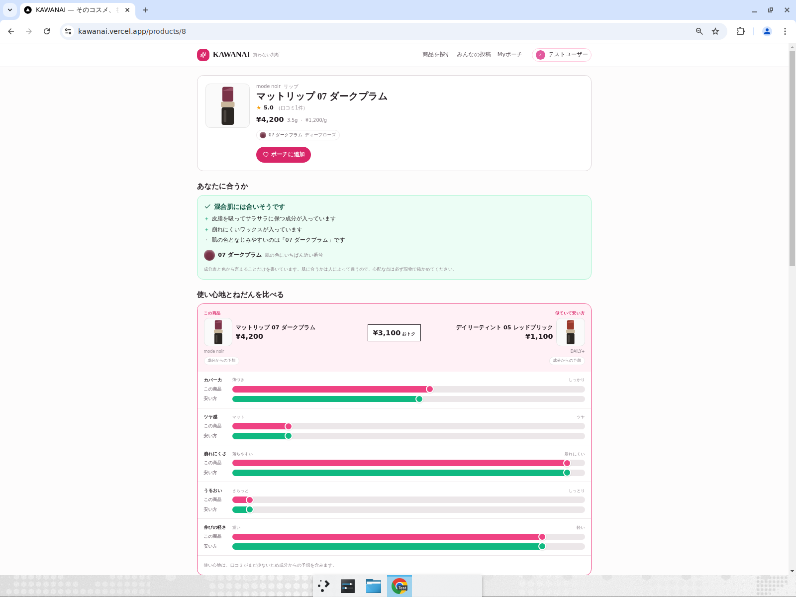
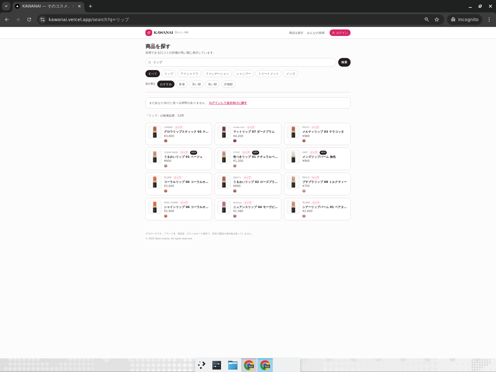
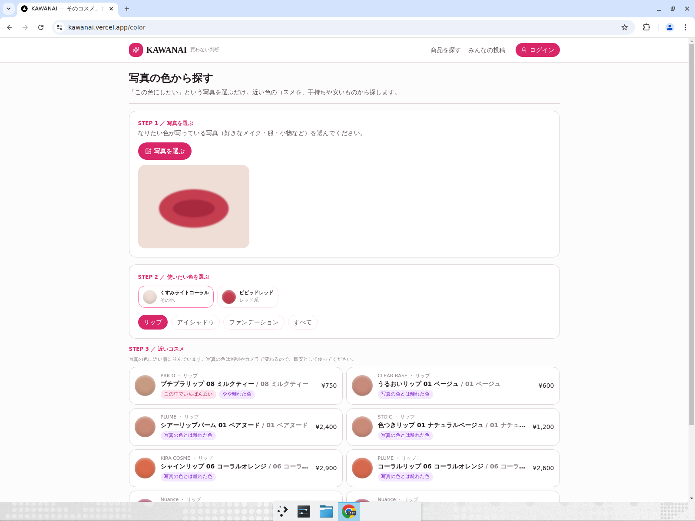
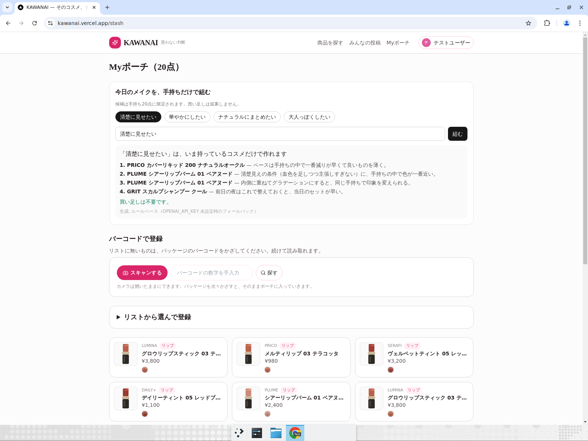

# KAWANAI

**「本当に自分に合うもの」を成分と色の数値で見つけるコスメ判断アプリ。**

LIPS や @cosme は「何が人気か」を教えてくれる。KAWANAI は手持ちコスメとプロフィール（肌の状態・肌の色）を持っているので、
気になった商品について **「あなたに合うか」「もう似たものを持っていないか」「似ていて安いものはあるか、でも高い方の良さは何か」** を数値で判定して見せる。
判定の材料は全成分表示（配合順）と色の実測値（CIELAB / ΔE CIEDE2000）で、口コミは信用できるものだけを集計に入れる。

- 3日間のハッカソン（AIAU Craft Day）で開発。Supabase と Devin を使用。
- コードはすべて Devin が書いている。人間がやったのは仕様の決定と却下、UI 文言の判断。

評価者向けの最短ルート: まず https://kawanai.vercel.app/ を下のテストユーザーで触る → 独自性は [判定の仕組み](#判定の仕組み) → Supabase / Devin の使い方は該当セクション → 動くことの確認は `npm run db:smoke`（[検証](#検証)に期待される出力あり）。

## 審査項目とこの README の対応

| 審査項目 | 該当セクション |
| --- | --- |
| スポンサーツール活用度（Supabase / Devin） | [Supabase の使い方](#supabase-の使い方) / [Devin の使い方](#devin-の使い方) |
| 完成度 / 動作 | [デモ](#デモ) / [セットアップ](#セットアップ) / [検証](#検証) |
| アイデア / 独創性 | [判定の仕組み](#判定の仕組み) |
| 課題解決 / インパクト | [解きたい課題](#解きたい課題) |
| プレゼンテーション | [機能](#機能) |

## デモ

- 公開URL: https://kawanai.vercel.app/
- テストユーザー（新規登録なしでログインできる）:
  - メールアドレス: `kawanai.test1@example.com`
  - パスワード: `kawanai-test-2026`
- ログイン不要で `/search`・商品ページ・`/color`・`/feed` は閲覧できる。手持ち登録・ポーチ・口コミ投稿は上のテストユーザーでログインすると試せる。
- ローカルで動かす場合は [セットアップ](#セットアップ) の5コマンド。

3分で価値が伝わる動線:

1. `/search` で商品を探す（信用できる口コミの評価が高い順に並ぶ）
2. 商品ページ上部で「あなたに合いそう／少し注意」と理由を読む
3. 同じページの比較セクションで「似ていて安い商品」との使い心地チャートと価格差を見る
4. `/color` に手持ちリップの写真を上げて、近い色の商品を探す
5. `/stash` で手持ちだけで組めるメイクを提案させる

商品ページ。上が「自分に合うか」の判定、下が「似ていて安い方」との使い心地5軸の比較（ΔEや類似度の数値は出さない）。



| 商品を探す（pg_trgm） | 写真の色から探す（CIELAB / ΔE） |
| --- | --- |
|  |  |

Myポーチ（手持ち）と、手持ちだけで組めるメイクの提案。



## 解きたい課題

**課題**: すでに同じようなものを持っているのに気づかないまま買ってしまう、そして衝動買いで買ってしまう。コスメの無駄買い。

**ターゲット**: 無駄なくコスメを買いたいけれど、何を買えばいいのか分からない学生・社会人。

なぜ気づけないのか。色番号の違いは店頭では判別できず（並べても ΔE が小さければ人の目では区別できない）、成分（＝中身）は英語の羅列で読めないため、
値段の差が中身の差なのかブランドの差なのか判断できない。既存の口コミアプリは人気順で「買う理由」を増やす方向にしか働かないので、
「これは今持っているものと何が違うのか」「自分に合うのか」には答えてくれない。

KAWANAI が答えるのは次の4つ。

- この商品は**自分の肌の状態と肌の色に合うか**（`src/lib/fit.ts`）
- **もう似たものを持っていないか**（成分 cosine + ΔE、`find_duplicates_in_stash`）
- **似ていて安いものはないか**（`find_cheaper_dupes`）
- それでも**高い方に良さはあるか**（使い心地5軸の差分、`src/lib/compare.ts`）

衝動買いは「その場で調べる時間がない」ときに起きるので、名前を入れるだけ（`/search`）で商品ページに
判定・被り・安い代替・高い方の良さが全部出るようにした。手持ちの登録は `/stash` のバーコード連続スキャンで、
カメラをかざし続けるだけで済ませられる（登録が面倒だと結局使われないため）。

「買わない」ためのアプリではなく、無駄を削って本当に必要なものに予算を回すためのアプリ。

## 機能

| 機能 | 実装 |
| --- | --- |
| トップ | `/`。未ログインは紹介ページ、本アカウントは肌情報・ポーチをもとにしたおすすめ |
| 商品を探す | `/search`。商品名・ブランド名を pg_trgm の類似度順で検索（`search_products`）、カテゴリ・メンズ絞り込み。信用できる口コミの評価が高い順 |
| 合うかどうかの判定 | 商品ページ上部（`src/components/FitCard.tsx`）。肌の状態×成分の役割、肌の色に近い色番号を提示。判定できないときは言い切らない |
| 似ていて安い物との比較 | `src/components/ComparePanel.tsx`。使い心地5軸のチャートで横並び、価格差と成分の違いを1行で。高い方の良さも同じ大きさで出す |
| 手持ち登録 | `/stash`（本アカウント限定、`/scan` はここへリダイレクト）。人気商品のチェックリストで一括登録 + zxing の連続バーコードスキャン（`src/components/BarcodeScanner.tsx`） |
| 被り検出 | `find_duplicates_in_stash` / `find_stash_overlaps`（pgvector cosine + ΔE） |
| 安い代替 | `find_cheaper_dupes`（類似スコア閾値 × 価格差） |
| 口コミ信頼度 | `recompute_review_trust`。スコアと除外理由は内部で使い、UI には出さない |
| 画像から色検出 | `/color`。主要色を抽出 → Lab 変換 → `find_by_color`。色名・系統・肌トーン順で提示 |
| 手持ちだけのメイク提案 | `/stash`（本アカウント限定）。`OPENAI_API_KEY` があれば LLM、無ければルールベース（公開デモは未設定なのでルールベースで動いている。画面下に生成方法を表示している） |
| 認証 / プロフィール | `/login`（初回はメールのリンクで確認し、プロフィール作成画面でパスワードを設定。以降はメールアドレス＋パスワードでログイン）、`/settings`、`/me`、`/u/[handle]` |
| 画像つき口コミ | `/feed`。1投稿4枚まで、Supabase Storage の `review-images` に保存。アップロード時に長辺1600pxのWebPへ縮小し、一覧はサムネ幅で読む |
| 成分の日本語化 | `src/lib/ingredients.ts` の辞書で日本語名・役割・効果に変換（INCI の英語をそのまま出さない） |
| 使用感 | `src/lib/feel.ts`。口コミがあれば平均、無ければ成分からの推定 |
| メンズ | シャンプー / トリートメント / BB / 日焼け止めをカテゴリに保持 |

## 判定の仕組み

判定は全部 Postgres 側で完結していて、Next.js は RPC を呼んで日本語に直すだけ。

```
                     Next.js 15 (App Router / Server Actions)
  画面 ─┬─ /search ──────────── rpc search_products         (pg_trgm)
        ├─ /products/[id] ───┬─ rpc find_cheaper_dupes      (pgvector cosine + ΔE)
        │                    ├─ rpc find_duplicates_in_stash
        │                    └─ src/lib/fit.ts / compare.ts / wording.ts（数値→日本語）
        ├─ /color ───────────── rpc find_by_color           (CIELAB / lab_delta_e)
        ├─ /stash ───────────── rpc find_stash_overlaps / find_palette_coverage
        └─ /feed ───────────── Storage: review-images + trg_reviews_recompute（信頼度）

  Postgres: products.ingredient_vec vector(256) ── HNSW 索引
            product_colors.lab double precision[] ── トリガで HEX から変換
            pg_cron: refresh_ingredient_idf_logged() を日次実行（IDF 再計算）
            RLS: 公開読み取り / 投稿条件を DB 側で強制
```

### 成分ベクトル

全成分表示は配合量の多い順に書かれるので、配合順を重みにして 256 次元にハッシュする。

```
w_i = (1 / log2(i + 2)) * idf(ingredient)
```

共通の基剤（水、BG、グリセリンなど）は IDF で寄与を落とす。L2 正規化して pgvector の cosine 距離で比較する。
ベクトル生成は Postgres 側の `build_ingredient_vec` + トリガなので、商品を入れれば自動で計算される。

#### 定期再計算

IDF は商品が増えるたびに変わるので、Supabase Cron（`pg_cron`）で日次 18:00 UTC（JST 3:00）に
`refresh_ingredient_idf_logged()` を実行し、DF / IDF を数え直して `products.ingredient_vec` を全行再生成する。
手動で走らせたい場合は `select refresh_ingredient_idf_logged();`。

実行ログは `maintenance_runs` に残る。最終実行はビューで確認する。

```sql
select * from ingredient_idf_status;
-- started_at | finished_at | duration_ms | products | ingredients | status | detail
```

### 色差

HEX → CIELAB に変換し、CIEDE2000 を Postgres 関数 `lab_delta_e` で計算する（クライアントに持ってこない）。

- ΔE < 1：ほぼ判別不能
- ΔE < 2：並べても見分けにくい
- ΔE < 5：似ている

UI には数値を出さず、`src/lib/wording.ts` で「見分けがつきません」「かなり近い色です」などの日本語に置き換える。
成分の cosine 類似度も同様に「中身ほぼ同じ」などにする。**ΔEや信頼度スコアは判定に使い、画面には出さない**という方針。

### 使い心地

成分は「中身が同じか」を証明できるが、使い心地は語れない。`src/lib/feel.ts` でツヤ / カバー力 / 崩れにくさ / うるおい / 伸び（ヘア系は別軸）を、
口コミの実測平均、無ければ配合順からの推定値として同じ軸で扱い、比較チャートに使う。

### 口コミの不正検出

削除はしない。疑わしい口コミは理由付きで残したまま、総合評価から外す。

- 文体の類似クラスタ / 投稿バースト / 同一ブランドへの偏重 / PR定型文 / 画像 pHash の使い回し（`src/lib/phash.ts`）

投稿ゲート: 本アカウント必須（未ログインは不可）、1日5件・同一ブランド1日2件・1商品1件まで。通報3件で総合評価から除外（削除はしない）。
持っているかどうかは自己申告なので投稿条件にはせず、手持ちに登録済みの人の口コミを集計で少し重く見る（`trust_score * 1.3`）だけにしている。
これらはすべて RLS ポリシーと DB のトリガで強制していて、アプリ側の実装ミスでは抜けない。

閲覧（商品・成分・口コミ・色検索）はログイン不要で、訪問者に匿名セッションも発行しない（公開読み取りは RLS の select ポリシーで anon ロールに許可している）。手持ち登録・ポーチの利用・口コミ投稿には本アカウントが必要。

## Supabase の使い方

CRUD だけでなく、**判定ロジック自体を Postgres 側に置いている**。

| 使った機能 | 用途 |
| --- | --- |
| Postgres + pgvector | 成分ベクトル `vector(256)` と cosine 距離での類似検索。全体検索は HNSW 索引、手持ちとの突き合わせは全件計算（`20260819000100_hnsw_ingredient_vec.sql` に選定理由） |
| Postgres 関数 | `lab_delta_e`（CIEDE2000 を SQL で実装）、`dupe_score`、`find_duplicates_in_stash`、`find_cheaper_dupes`、`find_stash_overlaps`、`find_by_color`、`find_palette_coverage`、`recompute_review_trust`、`search_products` |
| pg_trgm | 商品名・ブランド名の部分一致と類似度検索（GIN 索引） |
| pg_cron | IDF の日次再計算と実行ログ（`maintenance_runs` / `ingredient_idf_status`） |
| トリガ | 商品登録で成分ベクトル生成、色の HEX → Lab 変換、口コミ投稿でレート制限・信頼度再計算・画像枚数制限・pHash 同期 |
| RLS / セキュリティ | 公開読み取りと投稿条件を DB 側で強制（`20260815000600_review_policies.sql`、`20260816000100_profiles_and_reviews.sql`、`20260815000700_harden_functions.sql` で `search_path` 固定） |
| Auth | メールのリンクで初回確認 → パスワード設定。匿名サインインは使わない |
| Storage | 口コミ画像 `review-images`（1投稿4枚まで、WebP へ縮小して保存、画像変換でサムネ配信） |
| Migrations / 型生成 | `supabase/migrations/` の14ファイルで再現。`npm run db:types` で TypeScript の型を生成する |

上の表の機能は `npm run db:smoke` で1つずつ実際に叩いて確認できる（[検証](#検証)に期待される出力を載せた）。

## Devin の使い方

このリポジトリのコードはすべて Devin が書いている。人間がやったのは仕様の決定と却下、UI 文言の判断。

| 任せたこと | 証拠 |
| --- | --- |
| MVP まるごと（成分ベクトル・ΔE・SQL関数・シード生成器） | [#1](https://github.com/yszwtrs-wttm/AIAU-cosme/pull/1) |
| 指摘18点からの設計案作成 → 合意 → 実装（専門用語の排除、成分の日本語化、認証、画像つき口コミ） | [#4](https://github.com/yszwtrs-wttm/AIAU-cosme/pull/4) |
| 商品ページの比較セクション統合、成分のタブ化 | [#5](https://github.com/yszwtrs-wttm/AIAU-cosme/pull/5) |
| 未ログイン向け紹介ページとログイン後トップの分離 | [#6](https://github.com/yszwtrs-wttm/AIAU-cosme/pull/6) |
| 認証方式の作り直し（コード → リンク＋パスワード） | [#7](https://github.com/yszwtrs-wttm/AIAU-cosme/pull/7) [#8](https://github.com/yszwtrs-wttm/AIAU-cosme/pull/8) [#9](https://github.com/yszwtrs-wttm/AIAU-cosme/pull/9) |
| Issue テンプレートと、**Issue を立てると Devin が自動で調査して修正 PR を出す仕組み** | [#11](https://github.com/yszwtrs-wttm/AIAU-cosme/pull/11) [#17](https://github.com/yszwtrs-wttm/AIAU-cosme/pull/17) / `.github/workflows/devin-on-issue.yml` |
| 上記の自動化で回した性能・セキュリティ・アクセシビリティの改善（trgm 検索、HNSW 索引、IDF の日次再計算、匿名サインイン廃止、画像の WebP 化 など） | [#104](https://github.com/yszwtrs-wttm/AIAU-cosme/pull/104) [#113](https://github.com/yszwtrs-wttm/AIAU-cosme/pull/113) ほか。Issue 起点の PR が並んでいる |
| ブラウザでの実機確認（全ページ表示・口コミ投稿・ポーチ公開の動作） | Devin のコンピュータ操作で実施 |

エージェントが自走できるようにリポジトリ側も整えている。

- `npm run db:reset` 一発でスキーマ + シードが再現する（判定ロジックの検証がすぐできる）
- `npm run seed:gen`（`scripts/generate_seed.py`）は**決定論的**にシードを生成するので、被り検出の結果が毎回同じ
- `.env.example` に必要な環境変数と、無い場合の挙動を明記
- Issue → Devin セッション → PR が GitHub Actions で自動で回る（`.github/workflows/devin-on-issue.yml`）

## セットアップ

前提: Node.js 20 以上、Docker（ローカル Supabase 用）、Python 3（シードを作り直す場合のみ）。

```bash
npm install
cp .env.example .env.local     # ローカルは npx supabase status のキーを入れる
npx supabase start             # Docker が必要
npm run db:reset               # マイグレーション + シード投入
npm run dev                    # http://localhost:3000
```

期待される状態: `npm run db:reset` の後、ブランド12件・商品38件・色番号52件・口コミ14件・成分85件が入る。
シードを作り直す場合は `npm run seed:gen`（`scripts/generate_seed.py` が決定論的に生成）。

シードの商品・ブランド・口コミはすべて架空。実在商品のデータは使っていない。

| 環境変数 | 必須 | 無いとどうなるか |
| --- | --- | --- |
| `NEXT_PUBLIC_SUPABASE_URL` | 必須 | 起動しない |
| `NEXT_PUBLIC_SUPABASE_ANON_KEY` | 必須 | 起動しない |
| `NEXT_PUBLIC_SUPABASE_IMAGE_TRANSFORM` | 任意 | 既定で Storage の画像変換を通す。使えない環境は `false` |
| `OPENAI_API_KEY` | 任意 | メイク提案がルールベースにフォールバック（機能は動く） |

### Docker が使えない場合

判定ロジックは全部 Postgres 側にあるので、Supabase クラウドのプロジェクト（無料枠でよい）に流し込めばローカルと同じ状態になる。

```bash
npm install
npx supabase login
npx supabase link --project-ref <project-ref>
npx supabase db push          # supabase/migrations/ を適用
# シード投入: Supabase の SQL Editor に supabase/seed.sql を貼るか、接続文字列で流す
psql "postgresql://postgres:<password>@db.<project-ref>.supabase.co:5432/postgres" -f supabase/seed.sql
cp .env.example .env.local    # URL と anon key をクラウドの値にする
npm run dev
```

- `vector` / `pg_trgm` / `pg_cron` はマイグレーション内で `create extension` しているので追加設定は不要
- 口コミ画像用の Storage バケット `review-images` もマイグレーションで作られる
- スモークテストはクラウドでも動く（SQL Editor に `scripts/smoke.sql` の SQL を貼る。先頭の `\echo` などのメタコマンドは除く）
- DB を立てずにコードだけ確認する場合は `npm install && npm run lint && npm run typecheck && npm run build` が Docker 無しで通る

つまずきやすい点:

- `npx supabase start` が失敗する → Docker が起動しているか確認
- ポート 3000 が埋まっている → `npm run dev -- -p 3001`
- バーコードスキャンはカメラ権限が必要（HTTPS か localhost のみ）

### 型定義の再生成

`src/lib/supabase/database.types.ts` は `supabase/migrations/` から生成する。マイグレーションを追加・変更したら再生成してコミットする。

```bash
npx supabase start             # ローカルDBが起動していること
npm run db:types
```

## 検証

コードが通ること:

```bash
npm run lint
npm run typecheck
npm run build
```

判定ロジックが実際に動くこと（ローカル Supabase 起動後）:

```bash
npm run db:smoke     # scripts/smoke.sql を流す
```

シードは決定論的に生成しているので、出力は毎回同じになる。期待される結果は次の通り。

| # | 確認していること | 期待される出力 |
| --- | --- | --- |
| 1 | シード件数 | ブランド12 / 商品38 / 色番号52 / 口コミ14 / 成分85 |
| 2 | トリガで成分ベクトルが入る | `missing = 0`, `filled = 38` |
| 3 | トリガで HEX → Lab 変換が入る | `missing = 0`, `filled = 52` |
| 4 | `lab_delta_e`（CIEDE2000）の実装 | 同色 `0.000`、白 vs 黒 `100.0` |
| 5 | pg_trgm の商品検索 | 「リップ」で5件、スコア付きで返る |
| 6 | `find_cheaper_dupes` | 4200円のリップに対し ing_sim 0.94 / 1100円の代替が最上位 |
| 7 | `find_by_color` | 与えた Lab に近い順（ΔE 昇順）で5件 |
| 8 | 口コミの信頼度計算 | 14件すべてにスコアが付き、5件が総合評価から除外される |
| 9 | IDF の再計算（pg_cron が叩く関数） | `products = 38`, `ingredients = 75`, `status = success` |

実際の出力（抜粋）:

```
== 6. 成分 cosine + 色差での「似ていて安い商品」 ==
                     target                      |                  cheaper                  | price_yen | ing_sim | delta_e | score
-------------------------------------------------+-------------------------------------------+-----------+---------+---------+-------
 mode noir マットリップ 07 ダークプラム (4200円) | DAILY+ デイリーティント 05 レッドブリック |      1100 |   0.940 |   15.93 | 0.564

== 8. 口コミの信頼度が計算され、集計に反映されているか ==
 reviews | scored | excluded_from_score
---------+--------+---------------------
      14 |     14 |                   5
```

## 既知の制約と今後

- 商品・ブランド・口コミ・成分はすべて架空の生成データ。実商品の JAN マスタは未接続（バーコードは自前のデモコードで読める）
- 成分辞書（`src/lib/ingredients.ts`）は主要成分のみ。辞書に無い成分は英語のまま出る
- 合うかどうかの判定は肌の状態・肌の色・成分の役割からの推定で、医療・効能の断定はしない
- 公開デモ（Vercel）は Supabase のホスト環境に繋いでいて、シードは上記の架空データ。口コミやポーチはテストユーザーの操作がそのまま残る

今後やること（3日で切った範囲）:

- 実商品の成分・JAN データ取り込み（成分ベクトルはトリガで自動生成されるので、データが入れば判定精度はそのまま伸びる）
- 商品ページから既存の手持ちとの被りを常時出す（現在はポーチ登録済みユーザーのみ）
- 口コミの信頼度モデルの評価（現在はルールベース。除外の妥当性を測る正解データがまだない）
- 肌の色の入力を写真から自動判定（`/color` の色抽出を顔写真に適用する）
